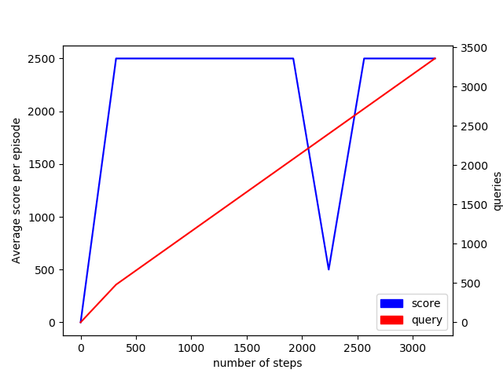
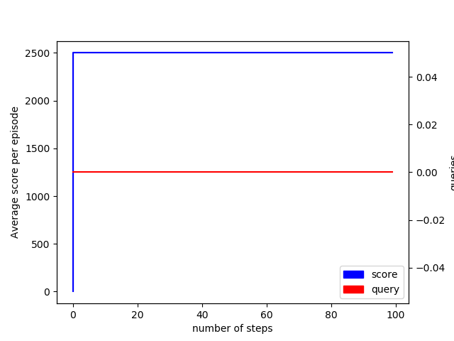

# Dagger

## 目录结构

```cmd
code
│  actors.py
│  arguments.py
│  Dagger.py
│  logger.py
│  main.py
│  performance.png
│  performance_test.png
│  README.md
│
├─checkpoints
│      data.pkl
│      imitator.pkl
│      record.pkl
│      train_cfg.pkl
│
└─run
    └─MontezumaRevengeNoFrameskip-v0
        └─CNNActor
            └─seed_1019_1019-21_00_36
                    events.out.tfevents.1634648436.LAPTOP-EQ1P4C6P.14684.0
```
逐文件介绍：

1. actors.py: 文件中包含实现 agent 从观测到动作映射的 `Actor` 模型类，目前实现了使用卷积神经网络实现的模仿学习 `CNNActor`.
2. arguments.py: 运行参数设置文件。
3. Dagger.py: 包含实现 Dagger 算法中 agent 策略的 `MyDaggerAgent` 类以及专家策略 `QueryAgent` 类。
4. logger.py: 实现日志输出类，包含普通文本输出 `Logger` 类以及 Tensorboard 日志输出 `TensorboardLogger` 类。
5. main.py: 入口文件，实现 agent 与环境交互采样以及 actor 训练更新等逻辑。
6. performance.png: 最终得到的训练过程中 log 记录的 agent 性能图。
7. performance_test.png: 额外对模型进行测试所得到的 agent 性能图。
8. checkpoints: 模型训练过程中保存的内容，包括：

    1. data.pkl: 保存的数据集，包含观察与对应的动作标签。
    2. imitator.pkl: 保存的模型参数，这里具体为 `CNNActor` 的参数。
    3. record.pkl: 保存的测试性能 log 记录。
    4. train_cfg.pkl: agent 训练过程中使用的关键配置。

9. run: 使用 logger 所产生的一些日志文件的保存。这里是使用 `TensorboardLogger` 所产生的日志文件。

## 用法

在 `code` 目录下输入命令 `python main.py --help` 可获取各个参数的说明：

```cmd
usage: main.py [-h] [--env-name ENV_NAME] [--num-stacks NUM_STACKS]
               [--num-steps NUM_STEPS] [--test-steps TEST_STEPS]
               [--num-frames NUM_FRAMES] [--seed SEED]
               [--log-interval LOG_INTERVAL] [--save-img SAVE_IMG]
               [--save-interval SAVE_INTERVAL] [--play-game PLAY_GAME]
               [--test] [--test-times TEST_TIMES] [--test-render] [--lr LR]
               [--device DEVICE]
               [--hidden-sizes [HIDDEN_SIZES [HIDDEN_SIZES ...]]]
               [--batch-size BATCH_SIZE]
               [--update-epochs [UPDATE_EPOCHS [UPDATE_EPOCHS ...]]]
               [--checkpoints-base CHECKPOINTS_BASE] [--load-base LOAD_BASE]
               [--log-base LOG_BASE] [--reload]

RL

optional arguments:
  -h, --help            show this help message and exit
  --env-name ENV_NAME
  --num-stacks NUM_STACKS
  --num-steps NUM_STEPS
  --test-steps TEST_STEPS
  --num-frames NUM_FRAMES
  --seed SEED
  --log-interval LOG_INTERVAL
                        log interval, one log per n updates (default: 10)
  --save-img SAVE_IMG
  --save-interval SAVE_INTERVAL
                        save interval, one eval per n updates (default: None)
  --play-game PLAY_GAME
  --test                only test the model
  --test-times TEST_TIMES
                        the total times for testing
  --test-render         render the game when testing
  --lr LR               learning rate of the Adam optimizer
  --device DEVICE       device for CNN actor tensor computing
  --hidden-sizes [HIDDEN_SIZES [HIDDEN_SIZES ...]]
                        sizes of the hidden layers in the CNN actor
  --batch-size BATCH_SIZE
                        the size of each batch samples for training CNN actor
  --update-epochs [UPDATE_EPOCHS [UPDATE_EPOCHS ...]]
                        the number of epochs for each update of CNN actor
                        (start, delta, end)
  --checkpoints-base CHECKPOINTS_BASE
                        the base of the checkpoint files
  --load-base LOAD_BASE
                        the base of the checkpoint files for reloading
  --log-base LOG_BASE   the base of the log files
  --reload              whether to reload data and model from load-base
```

各个参数的默认值可以在 `arguments.py` 中进行查看和修改。

举例：

完整地进行 Dagger 算法的运行与训练可以使用命令：

```cmd
python main.py --seed 233 --update-epochs 10 -1 5
```

上述命令将使用 233 作为随机数种子，开始训练 agent. 每次 update 时将使用整个数据集对 agent 进行若干轮训练，训练轮数最初为 10, 每次 update -1, 最终到达 5 时保持不变。

使用保存的模型进行断点训练可使用命令：

```cmd
python main.py --reload
```

上述命令将加载 `--checkpoints-base` 所指定目录下的文件，在上一次的进度下继续训练。需要注意的是，文件中保存了之前的更新次数，并会在上一次更新次数的基础上继续训练，如果之前更新的次数已达当前参数下的最大，则需要调整参数让训练过程的更新次数增多。

使用保存的模型进行测试可使用命令：

```cmd
python main.py --test --reload --test-render --test-steps 200
```

### 专家输入方式
使用上下左右方向键以及空格键与游戏动作中的上下左右动作以及跳跃动作进行对应，输入完毕后需要按回车键进行确定；若没有输入其他按键仅按回车键，则会视作输入空动作；标注过程中若需要退出程序可以按 ESC 键。

具体的键盘监听代码在 `Dagger.py` 文件的 `QueryAgent` 类中实现，可以查看该文件中对于按键与动作映射的定义。

## 效果

训练效果（每一个 step 代表一次采样）：



测试效果（每一个 step 代表一轮测试）：



## reference

- https://github.com/thu-ml/tianshou